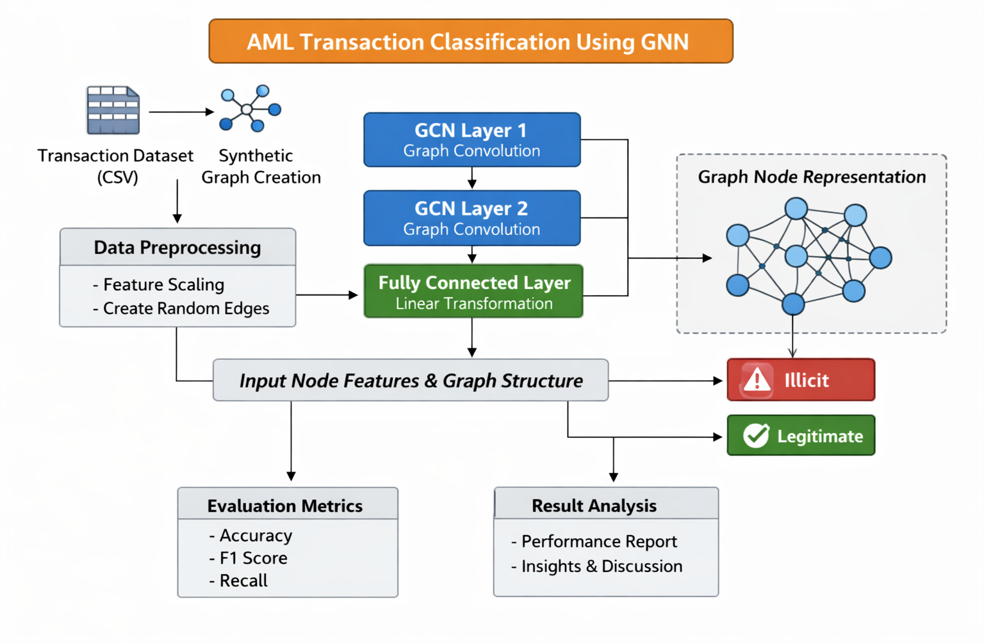
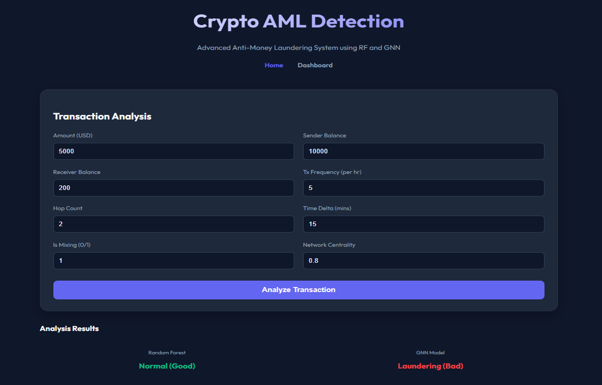
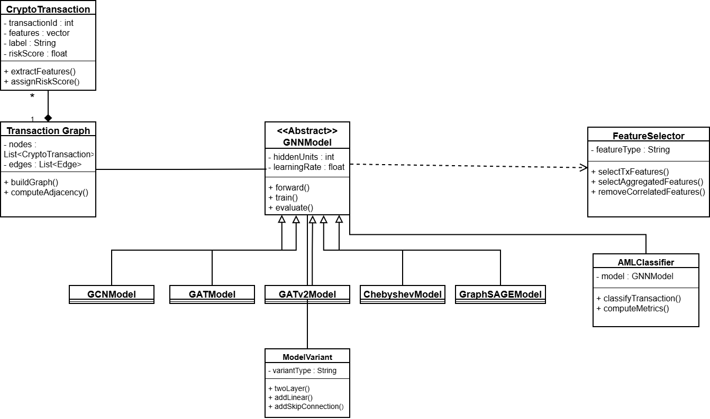
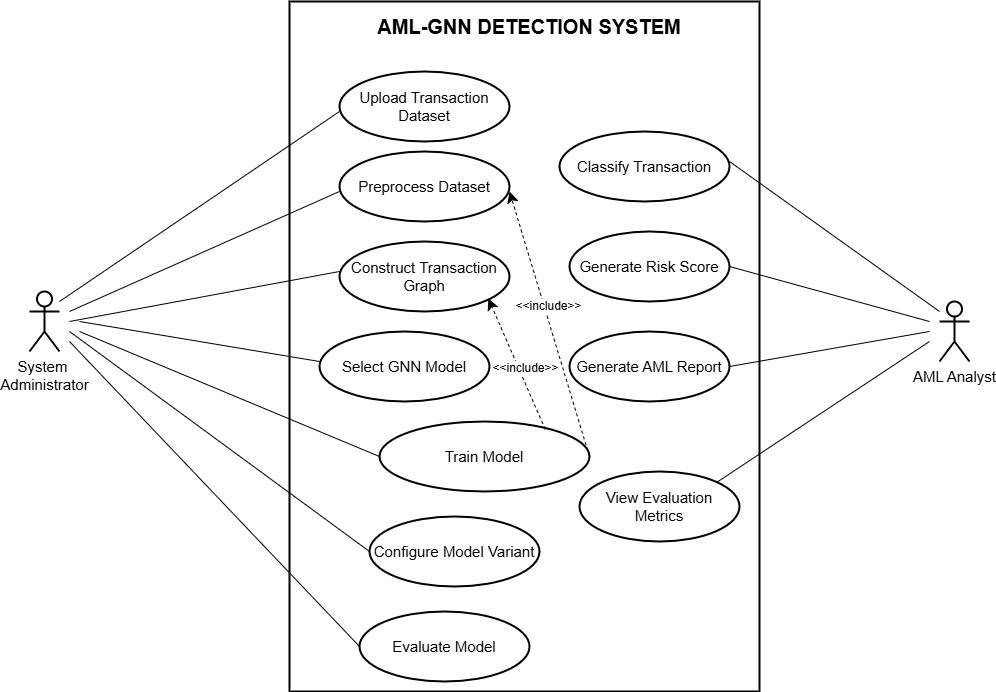

# 🔍 AML Detection using Graph Neural Networks (GNN)

## 📌 Project Overview
This project focuses on detecting illicit cryptocurrency transactions using Graph Neural Networks (GNNs). Due to the decentralized and pseudonymous nature of blockchain systems, traditional AML techniques struggle to identify suspicious activities. This system leverages graph-based learning to model transaction relationships and detect fraudulent patterns effectively.

---

## 🚀 Key Features
- 📊 Transaction graph construction (nodes = wallets, edges = transactions)
- 🧠 Multiple GNN models: GCN, GAT, GraphSAGE
- ⚠️ Risk scoring for AML compliance
- 🔍 Classification: Licit vs Illicit transactions
- 📈 Visualization of transaction insights

---

## 🛠️ Tech Stack
- **Programming:** Python  
- **Frameworks:** PyTorch / TensorFlow  
- **Libraries:** NetworkX, Pandas, NumPy  
- **Frontend:** HTML, CSS  

---

## 📊 Dataset
- Cryptocurrency transaction dataset (Kaggle)
- Includes transaction features, timestamps, and labels

---

## 🧠 Models Implemented
- GCN (Graph Convolutional Network)
- GAT (Graph Attention Network)
- GraphSAGE

---

## 🏗️ System Architecture
> Add your architecture diagram here



---

## 📸 Output Screenshots
> Add your project outputs here



---

## 📐 UML Diagrams
> Add your UML diagrams here




---

## ▶️ How to Run

```bash
# Install dependencies
pip install -r requirements.txt

# Run the application
python app.py
